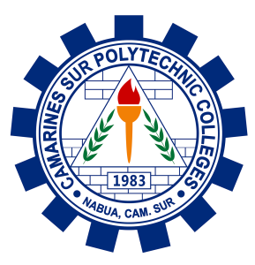

# 🎓 CSPC SIAS Online Portal — Redesign

<div align="center">



**Camarines Sur Polytechnic Colleges**  
*Nabua, Camarines Sur*

[](https://getbootstrap.com/)
[](https://fontawesome.com/)
[](https://jquery.com/)
[]()

</div>

---

## 📋 Table of Contents

- [Project Overview](#-project-overview)
- [Features](#-features)
- [Pages & Modules](#-pages--modules)
- [Project Structure](#-project-structure)
- [Tech Stack](#-tech-stack)
- [Color Palette](#-color-palette)
- [Getting Started](#-getting-started)
- [Known Issues & Limitations](#-known-issues--limitations)
- [Future Improvements](#-future-improvements)
- [Credits](#-credits)

---

## 📌 Project Overview

The **CSPC SIAS Online Portal Redesign** is a front-end redesign of the Student Information and Academic System (SIAS) of **Camarines Sur Polytechnic Colleges (CSPC)**. This project reimagines the user interface of the existing portal with a cleaner, more modern layout while preserving all the core functionalities used by students, instructors, and administrators.

The portal serves as the primary academic management hub for CSPC stakeholders — enabling enrollment, grade monitoring, curriculum evaluation, and student profile management.

> **Version:** SIAS Online 3.5.5.2  
> **Year:** 2024  
> **Institution:** Camarines Sur Polytechnic Colleges, Nabua, Camarines Sur

---

## ✨ Features

### 🔐 Authentication
- Role-based login pages for **Student**, **Instructor**, and **Administrator**
- Password visibility toggle (show/hide) for both User ID and Password fields
- "Remember Me" checkbox
- Client-side form validation with empty-field alerts
- "Forgot Password" link redirecting to Contact/FAQ page

### 🏠 Landing Page (`index.html`)
- Animated multilingual welcome message using **Typed.js** (40+ languages supported)
- Role selection buttons: Administrator, Instructor, Student, Admission
- CSPC branding with institutional logo

### 📊 Student Dashboard (`dashboard.html`)
- Personalized welcome header with student name
- Dropdown navigation menu:
  - **Transactions:** Change Password, Student Profile, Pre-enlistment, Enrollment, Assessment, Learning Modules, Online Tasks, Test Scores, Teacher Evaluation, Disable ID Card, Online Payment (DragonPay), Express Payment
  - **Reports:** Enrolled Subjects, Class Absences, Term/Final Grades, GWA, Curriculum Evaluation, Statement of Accounts, In/Out Monitoring, eWallet Transactions, Purchases Report
  - **Help:** Support, About
- Logout confirmation modal
- Student profile card with avatar, course, student ID, and CSPC email
- Responsive hamburger menu for mobile devices

### 📚 Curriculum Evaluation (`curriculum_eval.html`)
- Accordion-style layout organized by year level and semester (1st Year 1st Sem → 4th Year 2nd Sem)
- Per-subject details: Subject Code, Subject Name, Units, Grade, Remark, and up to 3 Takes
- Responsive table with horizontal scroll for small screens

### 📝 Enrolled Subjects (`enrolled_subs.html`)
- Table listing currently enrolled subjects for the active term

### ❓ Contact / FAQ Page (`contact.html`)
- 6 frequently asked questions with clear answers
- Contact information: phone number, physical address, and email
- "Send Us a Message" contact form with Name, Email, and Message fields
- Integrated **Drift** live chat widget

---

## 📁 Pages & Modules

| File | Role | Description |
|------|------|-------------|
| `index.html` | Public | Landing page with role selection and multilingual welcome |
| `student.html` | Student | Student login form |
| `instructor.html` | Instructor | Instructor login form |
| `administrator.html` | Admin | Administrator login form |
| `admission.html` | Applicant | Admission applicant login *(placeholder — currently empty)* |
| `dashboard.html` | Student | Main student dashboard and profile page |
| `enrolled_subs.html` | Student | Enrolled subjects report |
| `curriculum_eval.html` | Student | Curriculum evaluation with per-semester grade breakdown |
| `contact.html` | Public | FAQ page and contact/message form |

---

## 📂 Project Structure

```
cspc-sias-portal/
│
├── index.html                  # Landing page
├── student.html                # Student login
├── instructor.html             # Instructor login
├── administrator.html          # Administrator login
├── admission.html              # Admission login (placeholder)
├── dashboard.html              # Student dashboard & profile
├── enrolled_subs.html          # Enrolled subjects report
├── curriculum_eval.html        # Curriculum evaluation
├── contact.html                # FAQ & contact page
│
└── images/
    ├── Camarines_Sur_Polytechnic_Colleges_Logo-289x300.png
    └── Camarines_Sur_Polytechnic_Colleges_Logo-289x300.ico
```

---

## 🛠 Tech Stack

| Technology | Version | Purpose |
|------------|---------|---------|
| HTML5 | — | Markup structure |
| CSS3 | — | Custom styling |
| JavaScript (Vanilla) | ES6+ | Form validation, toggle visibility, menu interaction |
| [Bootstrap](https://getbootstrap.com/) | 5.3.3 | Responsive layout, components, utilities |
| [Bootstrap](https://getbootstrap.com/) | 4.1.3 | Legacy dropdown compatibility (dashboard) |
| [jQuery](https://jquery.com/) | 3.3.1 slim | DOM manipulation for Bootstrap 4 components |
| [Font Awesome](https://fontawesome.com/) | 6.x (Kit) | Icons throughout the portal |
| [MDB UI Kit](https://mdbootstrap.com/) | 7.2.0 | Extended Bootstrap components |
| [Typed.js](https://mattboldt.com/demos/typed-js/) | 2.1.0 | Animated multilingual typewriter effect on landing page |
| [Drift](https://www.drift.com/) | 0.3.1 | Live chat widget on contact page |
| [Popper.js](https://popper.js.org/) | 1.14.3 | Tooltip and dropdown positioning |

> **Note:** Both Bootstrap 4 and Bootstrap 5 are loaded simultaneously in `dashboard.html` and `curriculum_eval.html` to support legacy dropdown behavior. This is a known technical debt item.

---

## 🎨 Color Palette

| Name | Hex | Usage |
|------|-----|-------|
| Deep Navy | `#081C46` | Top navbar background |
| Royal Blue | `#0F2E66` | Header, primary buttons, form borders |
| Medium Blue | `#195189` | Footer background, secondary hover states |
| Light Blue | `#ADD8E6` | Navigation link text, button text accents |
| Silver Gray | `#CCCCCC` | Welcome text, cancel buttons, mobile menu |
| White | `#FFFFFF` | Body background, button text |

---

## 🚀 Getting Started

### Prerequisites

No server or build tools are required. This is a **static HTML/CSS/JS** project and runs directly in any modern browser.

### Running Locally

1. **Clone or download** the repository:
   ```bash
   git clone https://github.com/your-username/cspc-sias-portal.git
   ```

2. **Navigate** to the project directory:
   ```bash
   cd cspc-sias-portal
   ```

3. **Open** `index.html` in your browser:
   ```bash
   # Option 1: Double-click index.html in your file explorer
   
   # Option 2: Use VS Code Live Server extension
   # Right-click index.html → "Open with Live Server"
   
   # Option 3: Use Python's built-in server
   python -m http.server 8000
   # Then open: http://localhost:8000
   ```

### Demo Login

Since authentication is front-end only (no backend), you can log in using **any non-empty** User ID and Password combination. The form will redirect to `dashboard.html` upon successful validation.

---

## ⚠️ Known Issues & Limitations

1. **No backend integration** — Authentication is purely front-end. Any non-empty credentials will pass validation. No real data is fetched or stored.

2. **Bootstrap version conflict** — `dashboard.html` and `curriculum_eval.html` load both Bootstrap 4 and Bootstrap 5 simultaneously. The dropdown menus use Bootstrap 4's `data-toggle` attribute, which is incompatible with Bootstrap 5's `data-bs-toggle`. This can cause inconsistent behavior across browsers.

3. **`admission.html` is empty** — The Admission login page exists in the navigation but has no content.

4. **Hardcoded student data** — The dashboard displays a static profile (`Juan Dela Cruz`, `C23456789`, `BS Computer Science`). This must be connected to a real data source for production use.

5. **`contact.html` back button** — The back button on the contact page links to `student.html` only, rather than dynamically returning to the previous user role page.

6. **Duplicate `id` attributes** — Multiple `dropdownMenuButton` IDs exist in the same page (`dashboard.html`, `curriculum_eval.html`), which violates HTML standards and may cause accessibility issues.

7. **Logout button selector error** — The logout script in `dashboard.html` uses `document.getElementById("logoutBtn")`, but the button is inside a Bootstrap 4 modal which may not be in the DOM at script load time.

8. **No loading states or error handling** — Form submissions have no loading indicators, and there is no user feedback for network errors.

---

## 🔮 Future Improvements

- [ ] Connect to a real backend (e.g., Spring Boot, Node.js, Laravel) for authentication and data retrieval
- [ ] Migrate entirely to Bootstrap 5, removing Bootstrap 4 dependency
- [ ] Add a parent/guardian portal role (currently not implemented)
- [ ] Implement proper session management (JWT or cookie-based)
- [ ] Complete the `admission.html` page with an applicant registration/login form
- [ ] Make the Contact page back button role-aware (return to the correct login page)
- [ ] Add dark mode toggle
- [ ] Improve accessibility (ARIA roles, keyboard navigation, color contrast ratios)
- [ ] Add a print/export feature for curriculum evaluation and enrolled subjects
- [ ] Implement real-time notifications for grades, enrollment updates, and announcements
- [ ] Progressive Web App (PWA) support for offline access

---

## 👥 Credits

| Role | Details |
|------|---------|
| **Institution** | Camarines Sur Polytechnic Colleges (CSPC) |
| **Campus** | San Miguel, Nabua, Camarines Sur 4434, Philippines |
| **Contact** | mict@cspc.edu.ph |
| **Phone** | (054) 288-44-21 to 23 |
| **System** | SIAS Online Portal v3.5.5.2 |
| **Copyright** | © 2024 Camarines Sur Polytechnic Colleges |

---

<div align="center">

*This project is an academic redesign exercise for the CSPC SIAS Online Portal.*  
*All institutional data, logos, and branding belong to Camarines Sur Polytechnic Colleges.*

</div>
